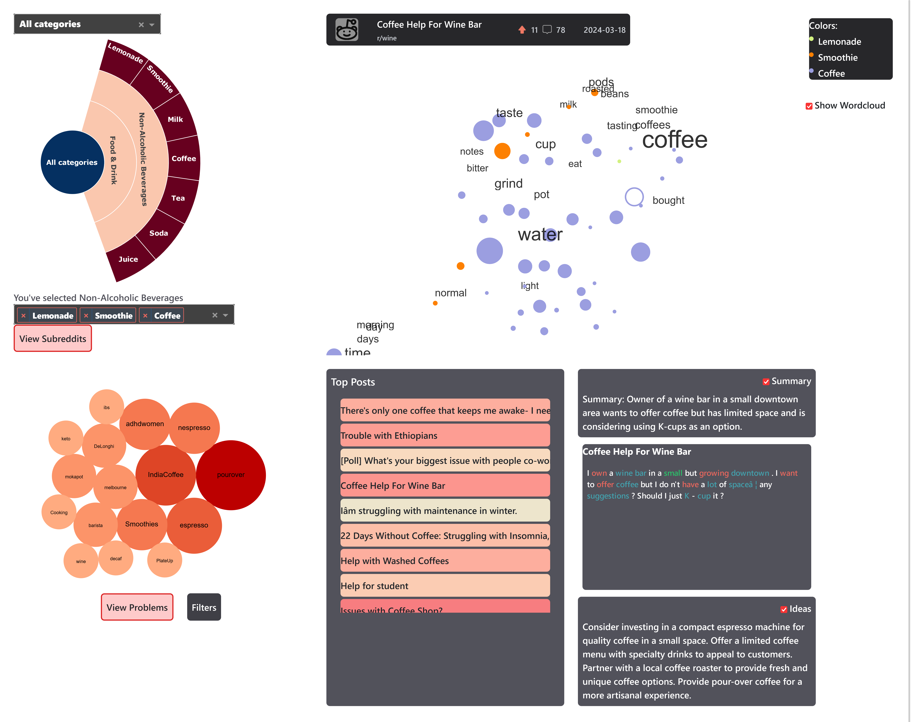
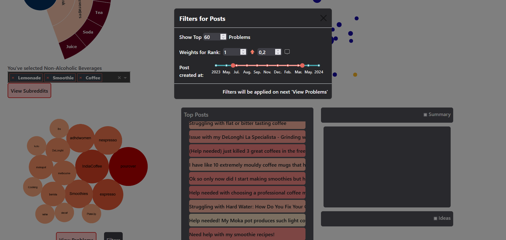

# ProblemExplorer: Interactive Visual Analysis of Reddit Problem Posts

## Overview

ProblemExplorer is a tool for analyzing and visualizing problem posts from Reddit. It uses word embeddings and UMAP for dimensionality reduction to create clusters of posts and generate word clouds for annotating the clusters. This allows for easy identification of relevant issues.

## Features

- **Data Retrieval from Reddit**: Fetch problem posts from Reddit using async webscraping with rotating proxies.
- **Word Embeddings**: Use pre-trained word embeddings (e.g., GloVe) to represent posts.
- **Clustering**: Group similar problem posts to identify common themes.
- **Dimensionality Reduction**: Apply UMAP to reduce dimensions for visualization.
- **Word Cloud Annotation**: Generate word clouds to visually represent frequent terms within clusters.
- **Customizable Visualization**: Adjust visualization and top posts with filters.

## Installation

To run the project locally, follow these steps:

1. Clone the repository:
   ```bash
   git clone https://github.com/louis.zk/ProblemExplorer.git
   cd problemexplorer
   ```

2. Install the dependencies:
   ```bash
   pip install -r requirements.txt
   ```

3. Download Glove.6B:
   https://nlp.stanford.edu/data/glove.6B.zip
   (50 Dimensions) and save it under glove.6B/glove.6B.50d.txt

4. Set OpenAI API credentials:
   (Only needed if you want summaries of the problems and/or ideas to solve them)
   Adjust `api_key.json`

5. Start the application:
   ```bash
   py Problemexplorer.py
   ```
   After a while, it runs locally under http://127.0.0.1:8050/ in your webbrowser.

## Usage

- Run `crawling_reddit_async.py` to fetch more Reddit posts from categories of your choice.
- Choose these categories in the Sunburst
- Choose Subreddits you want to analyse further
- Explore Problems

## Screenshots





